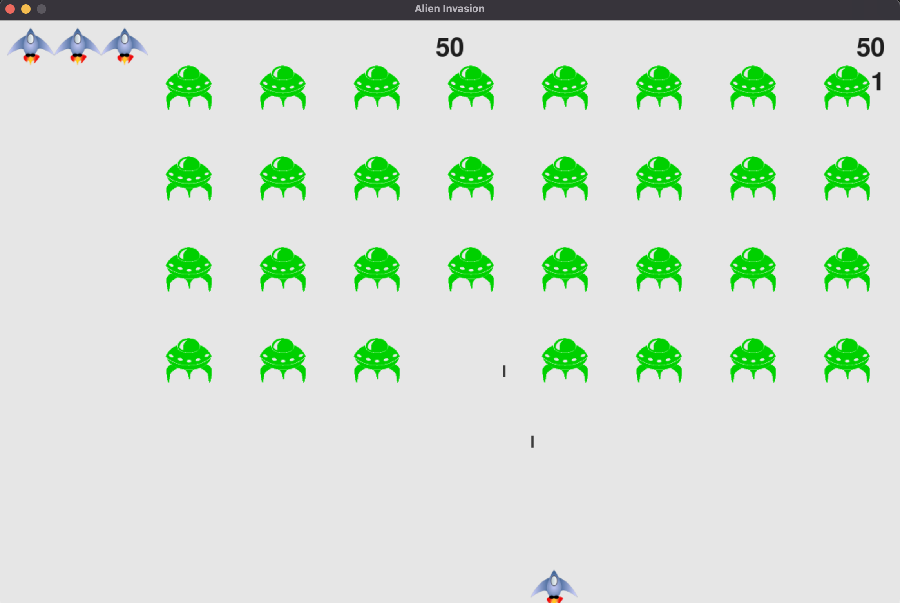

Made by: L1BC_Cristoval Neo Sasono_2602158235

## Game Project - Alien Invasion

---

This project is built from the book "Python Crash Course: A Hands-On, 
Project-Based Introduction to Programming", written by Eric Matthes.

In Alien Invasion, the player controls a ship that appears at 
the bottom center of the screen. The player can move the ship 
right and left using the arrow keys and shoot bullets using the 
spacebar. When the game begins, a fleet of aliens fills the sky 
and moves across and down the screen. The player shoots and 
destroys the aliens. If the player shoots all the aliens, a new fleet 
appears that moves faster than the previous fleet. If any alien hits 
the player’s ship or reaches the bottom of the screen, the player 
loses a ship. If the player loses three ships, the game ends

## Preview

---

## Requirements

---

Before running the code, make sure to use at least Python 3.0 and have the 'pygame' 
module working properly. 

## Controls

---

- Left/Right Arrow Keys: To move the spaceship left or right
- Spacebar: To shoot bullets

